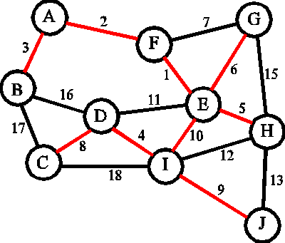

# kruskalsMWST
Find the Minimum Weight Spanning Tree (MWST) of an undirected and weighted graph using Kruskal's Algorithm.
https://en.wikipedia.org/wiki/Kruskal%27s_algorithm

implemented in c++.

GIF FROM WIKI:

